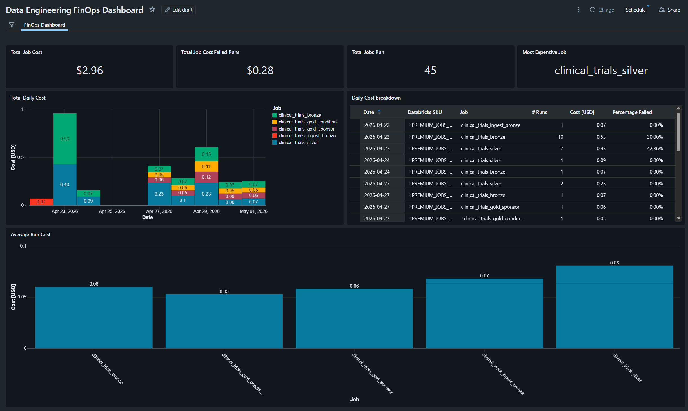

# data-engineering-case
This repository represents my submission for the data engineering case as described in [Case Outline](data_engineer_case.pdf). In this case, I was tasked with building a pipeline that ingests data from ClinicalTrials.gov and using that to highlight the most important aspects of my data engineering skillset given a time constraint of 6 hours. 

## Architecture

``` mermaid
%%{init: {"flowchart": {"defaultRenderer": "elk"}} }%%                                                                                                                                                                                                                                
  flowchart LR                                                                                                                                                                                                                                                                          
      subgraph CICD [CI/CD]
          direction TB
          GH[GitHub Actions] --> DAB[Databricks Asset Bundle]                                                                                                                                                                                                                           
      end                                                                                                                                                                                                                                                                             

      API[ClinicalTrials.gov v2 API]                                                                                                                                                                                                                                                    
  
      subgraph Medallion [Medallion - Databricks Free Edition]
          direction LR                                                                                                                                                                                                                                                                
          Bronze[(Bronze<br/>clinical_trials)]
          Silver[(Silver<br/>clinical_trials)]                                                                                                                                                                                                                                          
          GoldS[(Gold<br/>sponsor)]
          GoldC[(Gold<br/>condition)]                                                                                                                                                                                                                                                   
      end                                                                                                                                                                                                                                                                               
  
      subgraph Obs [Observability - cost and run health]
          direction LR                                                                                                                                                                                                                                                                
          SysRuns[(system.lakeflow.<br/>job_run_timeline)]
          SysBill[(system.billing.usage)]                                                                                                                                                                                                                                               
          Dash{{AI/BI Dashboard<br/>cost + success per job}}
      end                                                                                                                                                                                                                                                                               
                                                                                                                                                                                                                                                                                      
      API -->|01_ingest_bronze<br/>cron Mon-Fri 15:00 UTC| Bronze                                                                                                                                                                                                                       
      Bronze -->|02_transform_silver<br/>table trigger| Silver
      Silver -->|03_transform_gold_sponsor<br/>table trigger| GoldS                                                                                                                                                                                                                     
      Silver -->|04_transform_gold_condition<br/>table trigger| GoldC                                                                                                                                                                                                                   
   
      CICD -. deploys .-> Medallion                                                                                                                                                                                                            
      Medallion -. job runs .-> SysRuns                                                                                                                                                                                                                                                 
      Medallion -. DBU usage .-> SysBill                                                                                                                                                                                                                                              
      SysRuns --> Dash
      SysBill --> Dash
```

## Delivery Outline:
For the case, I wanted to emphasize the platform / architecture aspect of Data Engineering in Databricks. I therefore focused on setting up the following:
- A medallion architecture with four jobs (bronze, silver, two gold), all of which are declared in `databricks.yml` and deployed reproducibly with `databricks bundle deploy`. Bronze stores raw JSON append-only; silver applies the schema and dedupes to current-state, and gold contains the business-facing aggregations. Job parameters (`job_id`, `run_id`, `run_time`) are passed into each notebook and written as audit columns.  
- An event-driven approach to orchestrations, where bronze runs on a cron aligned with the upstream API refresh window; silver and the two gold jobs are triggered by Delta table updates on their upstream tables.
- A CI/CD setup that allows for local testing in a dev environment as well as a prod environment where every push to `main` validates and deploys the bundle to the `prod` target using GitHub Actions, so workspace state never drifts from `main`.
- An AI/BI dashboard built on `system.lakeflow.job_run_timeline` and `system.billing.usage` that accurately tracks the DBU layer of the job costs, allowing different jobs to be benchmarked against each other to optimize performance and cost. 

## Dashboard

## Next steps:
To further develop the case, given more time, I would focus on:

Jobs/pipelines operationalization: 
- Adding unit tests for pipelines to CI/CD using pytest. 
- Scale bronze pipeline to get the full dataset, changing from notebook architecture to DLTs. 
- Adding quarantine tables and DLT quality checks. 
- Switch silver to a MERGE operation to avoid unnecessary overwrites. 
- Consume gold tables for benchmarking research activities by organization and understanding research frequency by disease. 

CI/CD maturity:
- Replace PAT with a service principal and OIDC.
- Add dashboard and schemas to bundle definition. 
- Enforce PRs rather than allowing direct commit to main. 

FinOps setup:
- Switch from name convention to UC tags for cost attribution. 
- Switch source to Azure Invoice instead of system tables. 